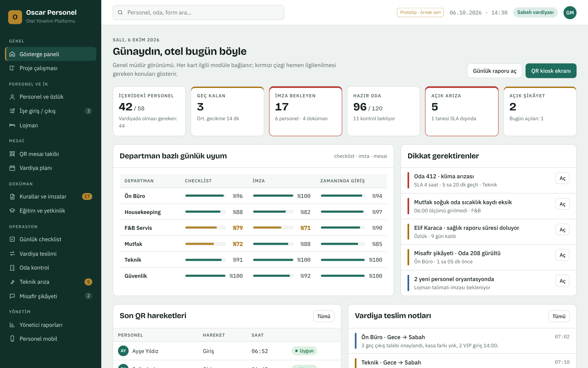
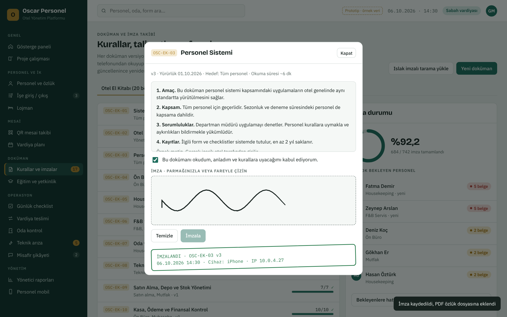
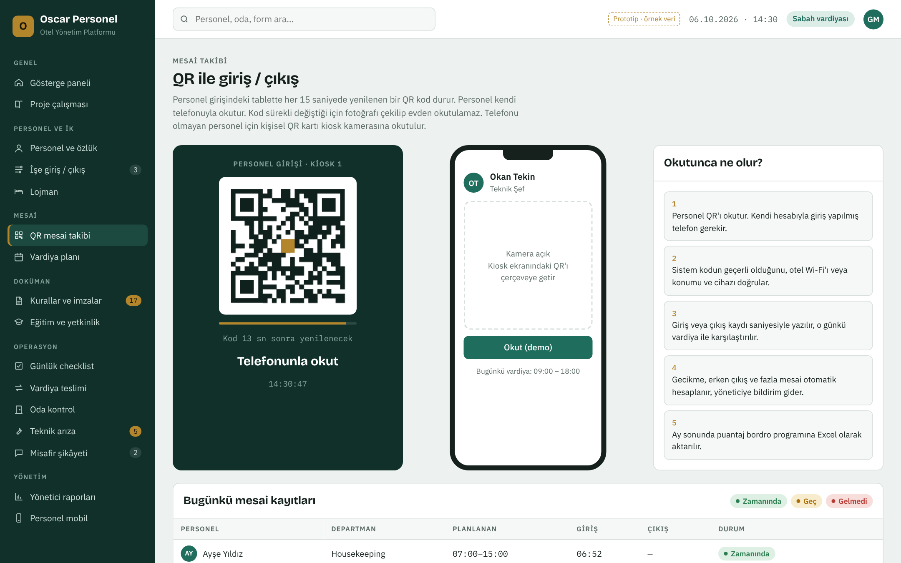
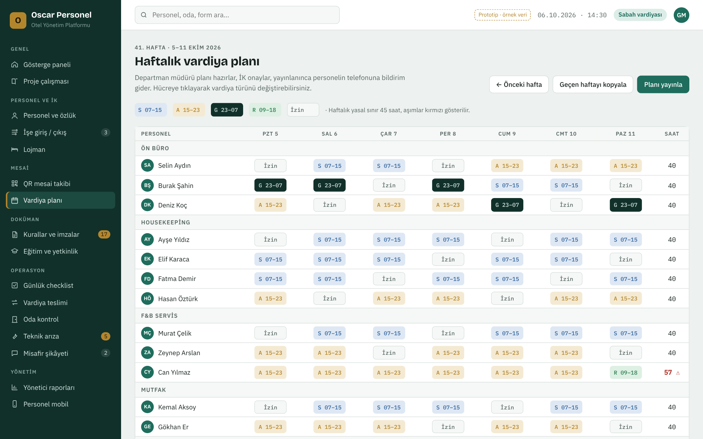
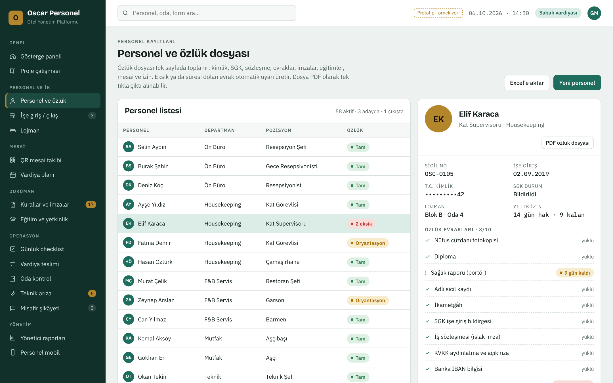
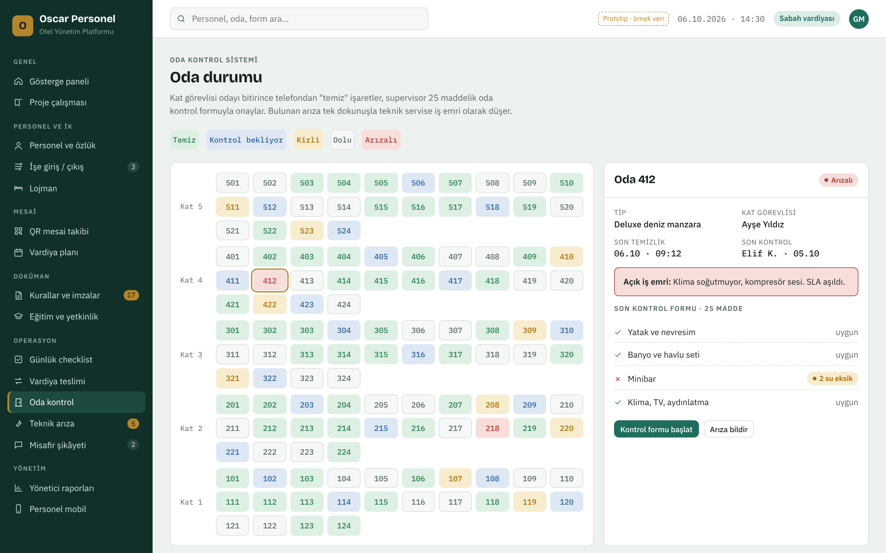
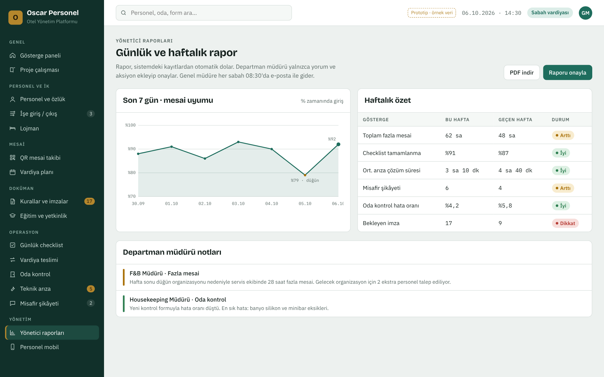

# Oscar Personel: Proje Çalışması

Otel personelini ve günlük operasyonu tek yerden yönetmek için web tabanlı bir platform.
Yöneticiler bilgisayardan, personel telefondan kullanır. Ayrı bir mobil uygulama gerekmez; site telefonun ana ekranına eklenir.

Tıklanabilir prototip: [`prototip/index.html`](../prototip/index.html). Ekran görüntüleri [`docs/gorseller`](gorseller) klasöründe.

---

## 1. Kullanıcı rolleri

| Rol | Ne yapar | Cihaz |
|---|---|---|
| Genel Müdür | Tüm oteli görür, raporları onaylar, dokümanları yayınlar | Bilgisayar, telefon |
| İnsan Kaynakları | Personel kaydı, özlük, işe giriş/çıkış, puantaj, eğitim planı | Bilgisayar |
| Departman Müdürü / Şef | Kendi ekibinin vardiyası, checklistleri, teslimleri, raporu | Bilgisayar, tablet |
| Personel | QR ile giriş/çıkış, doküman imzası, vardiyası, görevleri, izin talebi | Telefon |
| Kiosk | Personel girişindeki tablet; dönen QR kodu gösterir | Tablet |

Her rol yalnızca yetkisi olan veriyi görür. Personel kendi kaydını, müdür kendi departmanını görür.

## 2. Modül haritası

| Modül | İçerik |
|---|---|
| **1. Personel ve İK** | Personel kayıtları, özlük dosyası (PDF çıktı), işe giriş ve çıkış süreci, lojman yerleşimi ve zimmet, izin talepleri |
| **2. Mesai ve Vardiya** | QR ile giriş/çıkış, haftalık shift planı, gecikme ve fazla mesai hesabı, aylık puantaj ve bordroya aktarım |
| **3. Doküman ve İmza** | Otel El Kitabı (20 bölüm), oryantasyon ve bilgilendirme formları, lojman talimatı, otel genel kuralları, versiyon ve yeniden imza takibi |
| **4. Günlük Operasyon** | Günlük checklistler, vardiya teslimleri, oda kontrol sistemi, teknik arıza ve bakım, misafir şikâyetleri |
| **5. Eğitim ve Yetkinlik** | Zorunlu eğitim takibi (İSG, yangın, hijyen, KVKK), katılım tutanakları, yetkinlik puanı, süresi dolan sertifika uyarısı |
| **6. Raporlama ve Denetim** | Günlük ve haftalık yönetici raporu, departman uyum skoru, iç denetim ve aksiyon takibi |

## 3. Otel El Kitabı: 20 bölüm

Her başlık sistemde ayrı bir **doküman** olur. Her dokümanın kodu, versiyonu, yürürlük tarihi ve "kimler imzalayacak" listesi vardır.
Doküman güncellendiğinde (ör. v2 → v3) ilgili personelden yeniden imza istenir.

| Kod | Bölüm | İmzalayacak |
|---|---|---|
| OSC-EK-01 | Sistemin Temel İlkeleri | Tüm personel |
| OSC-EK-02 | Otel Yönetim Sistemi | Yöneticiler |
| OSC-EK-03 | Personel Sistemi | Tüm personel |
| OSC-EK-04 | Ön Büro Operasyonu | Ön Büro |
| OSC-EK-05 | Housekeeping Operasyonu | Housekeeping |
| OSC-EK-06 | F&B ve Mutfak Operasyonu | F&B, Mutfak |
| OSC-EK-07 | Oda ve Genel Otel Kalite Standardı | Housekeeping, Ön Büro |
| OSC-EK-08 | Teknik, Bakım ve Tesis Yönetimi | Teknik |
| OSC-EK-09 | Satın Alma, Depo ve Stok Yönetimi | Satın alma, Mutfak |
| OSC-EK-10 | Kasa, Ödeme ve Finansal Kontrol | Ön Büro, Muhasebe |
| OSC-EK-11 | Misafir Yönetimi ve Şikâyetler | Ön Büro, F&B |
| OSC-EK-12 | Güvenlik, Acil Durum ve Olay Yönetimi | Tüm personel |
| OSC-EK-13 | KVKK ve Bilgi Güvenliği | Tüm personel |
| OSC-EK-14 | Haşere, Atık ve Çevre Yönetimi | Teknik, Housekeeping |
| OSC-EK-15 | Tesis, Ruhsat, Belge ve Mevzuat Kontrolü | Yöneticiler |
| OSC-EK-16 | Form, Checklist ve Kayıt Sistemi | Yöneticiler |
| OSC-EK-17 | Yönetici Raporlama ve Kontrol Sistemi | Yöneticiler |
| OSC-EK-18 | Günlük Otel Operasyon Döngüsü | Yöneticiler |
| OSC-EK-19 | Uygulama, Denetim ve Sürekli İyileştirme | Yöneticiler |
| OSC-EK-20 | Son Kontrol: Otelin Her Gün Çalışır Durumda Olması | Yöneticiler |

"İmzalayacak" sütunu öneridir, otel yönetimi tarafından netleştirilecek.

İşe giriş formları: Oryantasyon Formu, Bilgilendirme Formu, Lojman Talimatı, Otel Genel Kuralları, KVKK Aydınlatma ve Açık Rıza, İSG Eğitim Katılım Tutanağı, Zimmet Teslim Formu, Kıyafet ve Hijyen Talimatı.

Bir bölüm yalnızca metin değildir. İçindeki formlar ve checklistler Modül 4'teki günlük kayıtlara bağlanır. Örneğin "Housekeeping Operasyonu" imzalanır, içindeki oda kontrol formu da her gün Oda Kontrol ekranında kullanılır.

### İmza yöntemi

- Telefonda "okudum, anladım" onayı ve parmakla imza; tarih, saat, cihaz ve IP bilgisi kaydedilir, imzalı PDF özlük dosyasına eklenir.
- Bu yöntem iç talimat ve bilgilendirme belgeleri için uygundur.
- İş sözleşmesi, ibraname gibi hukuki ağırlığı yüksek belgeler için ıslak imzalı kâğıt taranıp özlüğe yüklenir veya nitelikli elektronik imza kullanılır.
- Hangi belgenin hangi yöntemle imzalanacağı iş hukuku danışmanıyla netleştirilmelidir.

## 4. QR mesai sistemi

1. Personel girişine bir tablet (kiosk) konur. Ekranda her 15 saniyede değişen QR kod döner.
2. Personel kendi telefonuyla okutur. İlk girişte telefon hesabına bir kez tanımlanır.
3. Sistem otel Wi-Fi'ına veya konuma bakar; başkasının yerine okutmayı ve evden okutmayı engeller.
4. Kayıt o günkü vardiya planıyla eşleşir: geç kalma, erken çıkış ve fazla mesai otomatik hesaplanır.
5. Ay sonu puantaj Excel olarak bordro programına aktarılır.

Telefonu olmayan personel için kişisel QR'lı yaka kartı verilir; kiosk tabletin kamerası kartı okur.

## 5. Vardiya planı

- Departman müdürü haftalık planı hazırlar, İK onaylar, yayınlanınca personelin telefonuna bildirim gider.
- Vardiya tipleri tanımlanabilir (ör. S 07–15, A 15–23, G 23–07, R 09–18, İzin).
- Haftalık 45 saat sınırını aşan personel kırmızı ile işaretlenir.
- "Geçen haftayı kopyala" ile plan hızlı hazırlanır.

## 6. Personel ve özlük

Özlük dosyası tek sayfada: kimlik, SGK, sözleşme, evraklar, imzalar, eğitimler, mesai ve izin.
Eksik veya süresi dolan evrak (sağlık raporu, hijyen sertifikası vb.) otomatik uyarı üretir. Dosya PDF olarak tek tıkla alınır.

İşe giriş adımları: Aday ve evrak → Sözleşme ve SGK → Oryantasyon → İmzalar ve lojman → Aktif.
İşten çıkış adımları: Çıkış talebi → Zimmet iadesi → Lojman teslimi → İbraname ve SGK çıkışı → Arşiv.
Bir adım tamamlanmadan sonraki açılmaz (ör. oryantasyon formu imzalanmadan QR mesai hesabı aktif olmaz).

## 7. Günlük operasyon

| Ekran | Nasıl çalışır |
|---|---|
| Günlük checklist | Her madde kimin, ne zaman işaretlediğiyle kaydedilir. Fotoğraf veya ölçüm (ör. soğuk oda °C) istenebilir. Saatinde tamamlanmayan liste yöneticiye düşer. |
| Vardiya teslimi | Standart teslim formu. Teslim eden ve alan iki taraf onaylar. Açık işler bir sonraki vardiyaya görev olarak düşer. |
| Oda kontrol | Kat görevlisi "temiz" işaretler, supervisor 25 maddelik formla onaylar. Bulunan arıza tek dokunuşla teknik servise iş emri olur. |
| Teknik arıza | Her departman bildirir, teknik şef atar, teknisyen fotoğrafla kapatır. Önceliğe göre SLA izlenir. Periyodik bakımlar takvimden otomatik oluşur. |
| Misafir şikâyeti | Kaynak, kategori, sorumlu departman ve telafi ile kaydedilir. Misafire geri dönüş yapılmadan kapanmaz. Tekrar eden konular aylık raporda kök neden analizine gider. |

## 8. Yönetici raporları

Rapor sistemdeki kayıtlardan otomatik dolar; departman müdürü yalnızca yorum ve aksiyon ekleyip onaylar.
Genel müdüre her sabah e-posta ile gider. Göstergeler: mesai uyumu, fazla mesai, checklist tamamlanma, arıza çözüm süresi, şikâyet sayısı, oda kontrol hata oranı, bekleyen imza.

## 9. Teknik yapı (öneri)

| Katman | Seçim | Neden |
|---|---|---|
| Arayüz | Duyarlı web (PWA) | Telefon, tablet ve bilgisayarda aynı uygulama; mağaza gerekmez |
| Uygulama | Python Django | Rol bazlı yetki, Türkçe dil desteği, hazır yönetim paneli, form ağırlıklı işler için hızlı geliştirme |
| Veritabanı | PostgreSQL | Güvenilir, ilişkisel kayıtlar ve raporlama |
| Dosya arşivi | S3 uyumlu depolama | İmzalı PDF'ler, evrak taramaları, fotoğraflar |
| Bildirim | E-posta, SMS / WhatsApp | Hatırlatma, gecikme ve SLA uyarıları |
| Entegrasyon | Excel/CSV, ileride API | Bordro programı ve PMS'e aktarım |

### KVKK

- Özlük verisi, sağlık raporu ve adli sicil kaydı özel nitelikli kişisel veri içerir.
- Sunucu Türkiye'de veya KVKK'ya uygun bir yerde barındırılır.
- Her kayda kimin baktığı loglanır; T.C. kimlik gibi alanlar maskelenir.
- Saklama süreleri tanımlanır, süresi dolan veriler arşivlenir veya silinir.

## 10. Yol haritası (tahmini)

| Faz | Süre | Kapsam |
|---|---|---|
| Faz 1 · Temel | ~4 hafta | Personel kaydı ve özlük, doküman ve imza (20 bölüm + formlar), QR mesai ve kiosk, rol ve yetkiler |
| Faz 2 · Vardiya | ~3 hafta | Haftalık shift planı, puantaj ve bordro aktarımı, işe giriş/çıkış süreci, lojman |
| Faz 3 · Operasyon | ~4 hafta | Checklistler, vardiya teslim, oda kontrol, teknik arıza, misafir şikâyeti |
| Faz 4 · Raporlama | ~3 hafta | Eğitim ve yetkinlik, yönetici raporları, iç denetim, PMS entegrasyonu (isteğe bağlı) |

## 11. Netleştirilmesi gerekenler

1. Kaç personel ve kaç departman var? Sezonluk dalgalanma ne kadar?
2. Personel girişi kaç noktadan? Kaç kiosk tableti gerekir?
3. Personelin ne kadarının akıllı telefonu var?
4. Bordro hangi programla yapılıyor (Logo, Mikro, Netsis, muhasebe firması)?
5. Otelde kullanılan PMS hangisi (Elektra, Opera, HotelRunner vb.)?
6. 20 bölümün metinleri hazır mı, yoksa sistemle birlikte mi yazılacak?
7. Tek otel mi, ileride birden fazla tesis mi olacak?
8. Arayüz yalnızca Türkçe mi, yabancı personel için İngilizce de gerekli mi?
